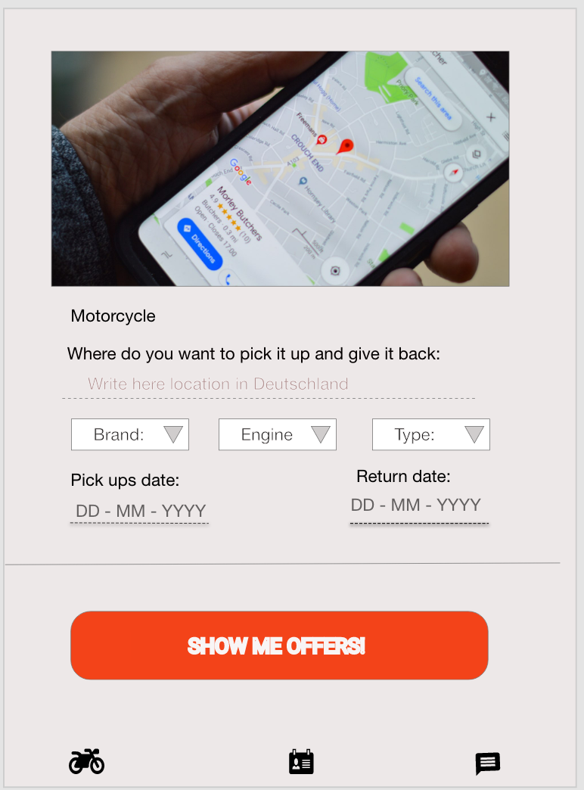

# rideandshare

sharing motorcycle project

## Landing page.

background: #F8F5F5

### Logo:
in a card of width: 805 and height: 414

### Text area: 
Where do you want to pick it up and give it back.

### Input field: 
only options display are: Cologne, Hamburg or Berlin.

### Text area: 
Pick up date:

3 input field: 
-input field day:
-input field month:
input field year:
attention: condition that allow only future npm
-input field month:
input field year:
attention: condition that allow only dates after the Pick up date. 

### button:
Show me offers!
background: #F43C10 (96%)
width: 734
height: 121

## Home page:

Display a page with the name of the app plus the logo.
A place to write where does the client want to use the motorcicle.
from when to  when is going to use it.
A button to display offers that match the information given.

3 small icons that take the user to 3 different pages.
home page, profile, chat.

## Page display of offers:

Here will display options in the selected city.
Every option is a card containing the following information:

owner's name:
Type of motorcycle:
Brand:
Engine size:
rental price:
small picture of the motorcycle:
 a contact via chat button:

 ## Chat:
 A screen were will be displlay the keybord and half of the screen to post the message.

## profile:
A record of how many times have the user use the app.
his age.
and how long does the user have motorcyle licence.

